# OStation 用户手册

**版本：** 1.0  
**作者：** 软件文档部  
**日期：** 2025年8月  

---

## 目录

1. [简介](#1-简介)  
2. [安装指南](#2-安装指南)  
3. [功能概览](#3-功能概览)  
  - [3.1 SparkleUpdate 工具](#31-sparkleupdate-工具)  
  - [3.2 运维管理网站](#32-运维管理网站)  
4. [使用说明](#4-使用说明)  
5. [常见问题解答](#5-常见问题解答)  
6. [更新历史](#6-更新历史)  
7. [GitHub 与社区支持](#7-github-与社区支持)  

---

## 1. 简介

整体包含3个部分
### 1.Ostation
### 2.SparkleUpdate
### 3.运维网站

## 2. 安装指南

*在此处填写安装步骤、系统要求等内容...*
### Ostation 预装在SSD
### SparkleUpdate 运维使用，MacOs
### 运维网站 https://unigobot.com/downloads

## 3. 功能概览

### 3.1 OStation
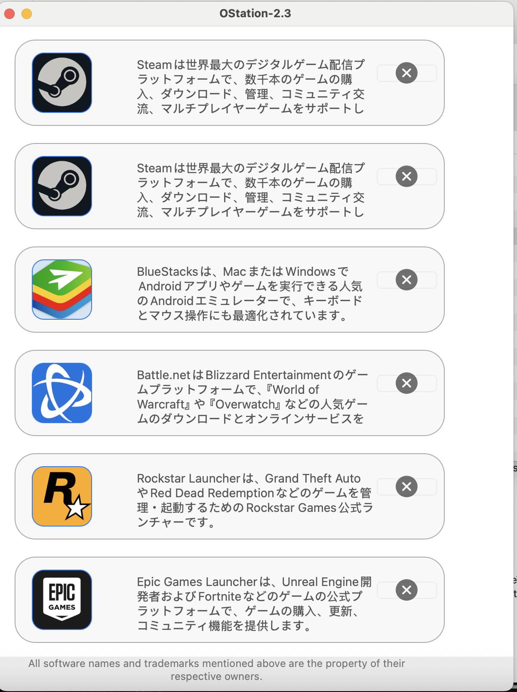 

### 3.2 SparkleUpdate 工具

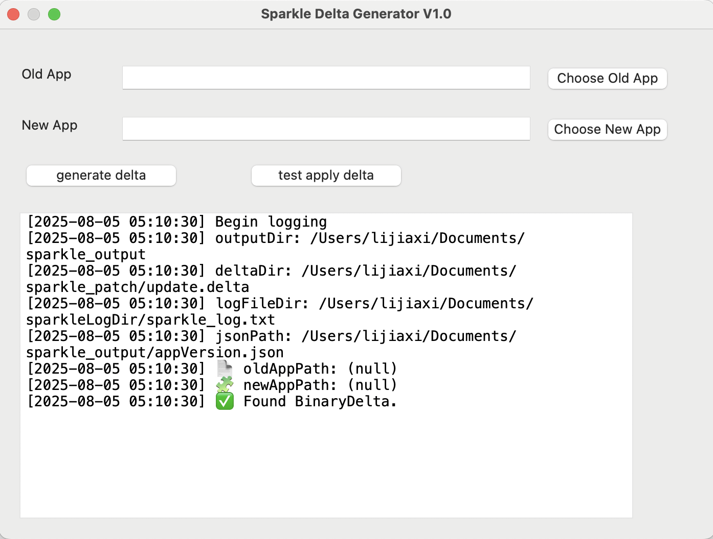

主界面

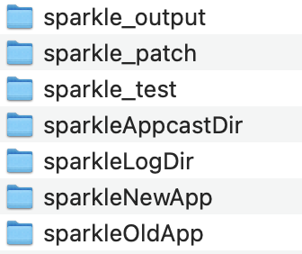

Dcoument 下的目录 ，如果没自动创建则手工创建

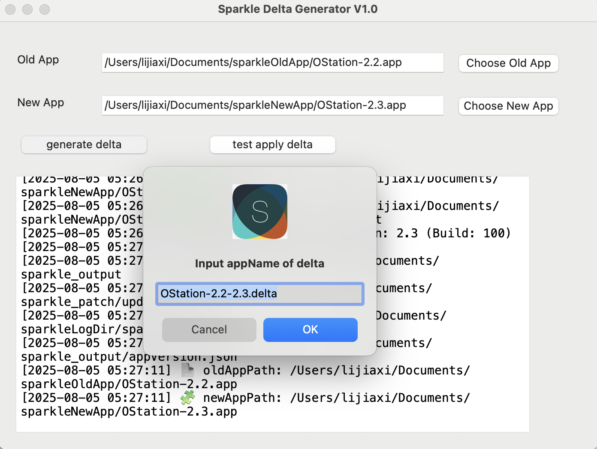

产生delte

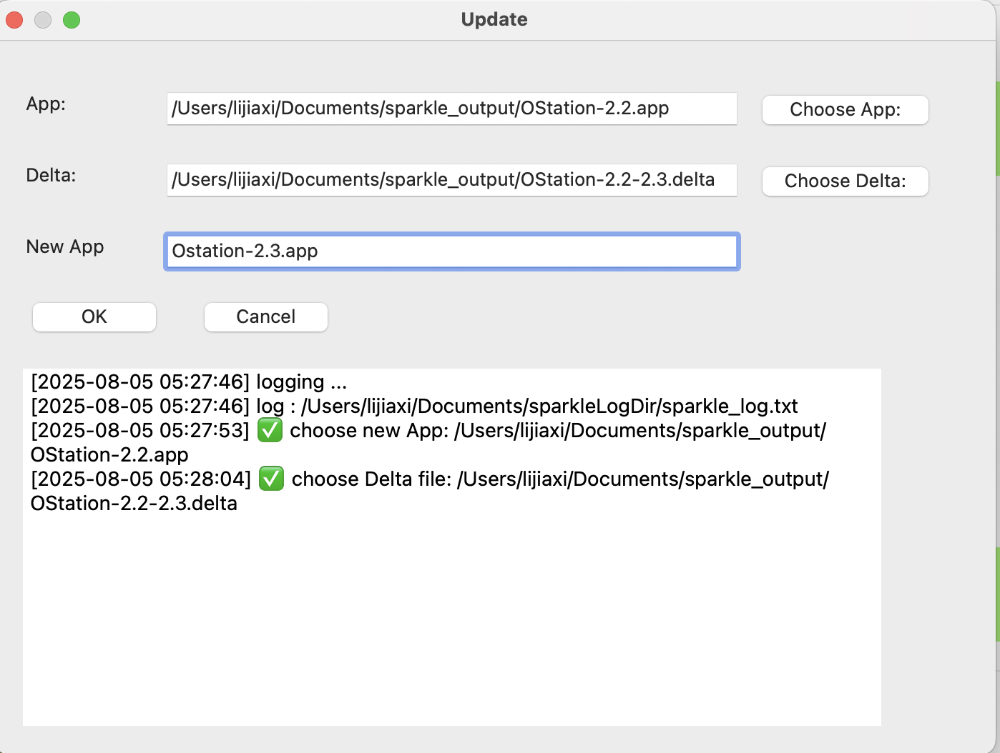

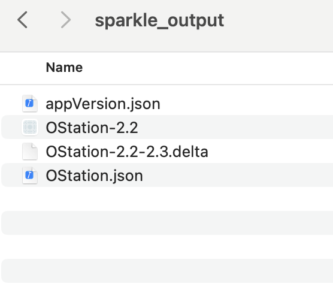

找到结果目录并测试 update

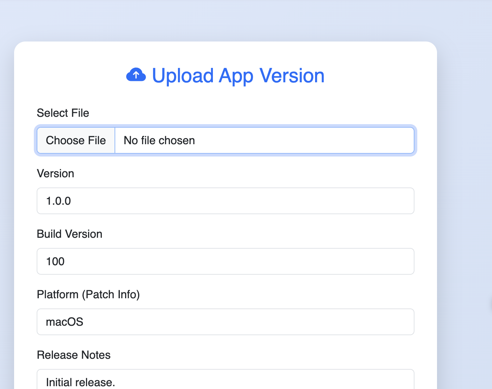

上传文件
1.OStation.json
2.OStation-2.2-2.3.delta

打开 SSD 目录找到OStation-2.2.app 并打开

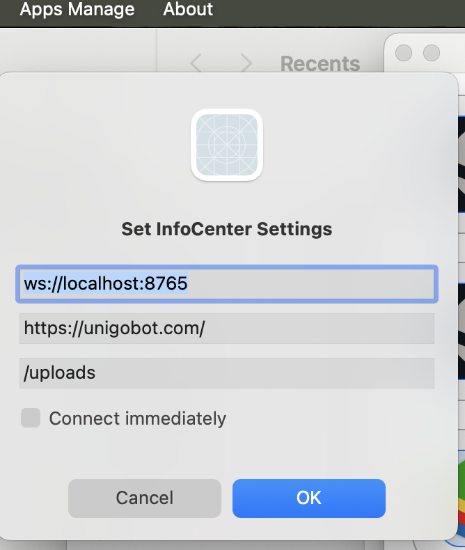

设置好url

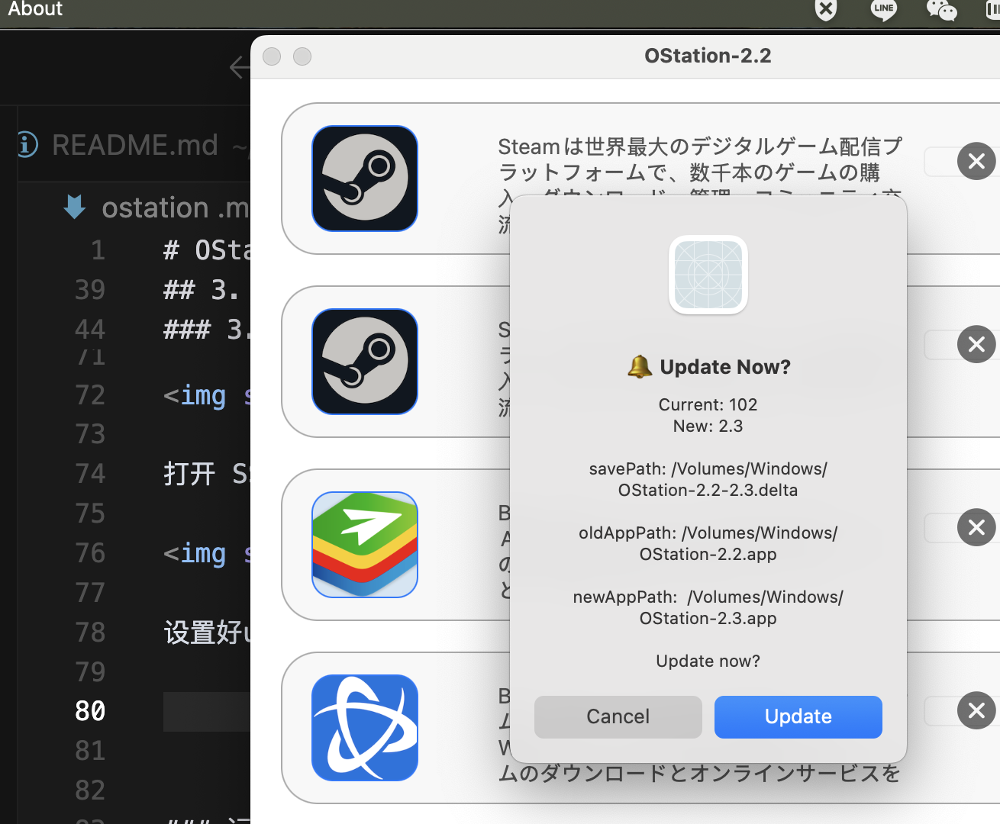

在About选update菜单，依照提示完成更新

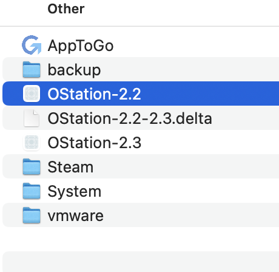

### 运维人员使用

### 3.3 运维管理网站

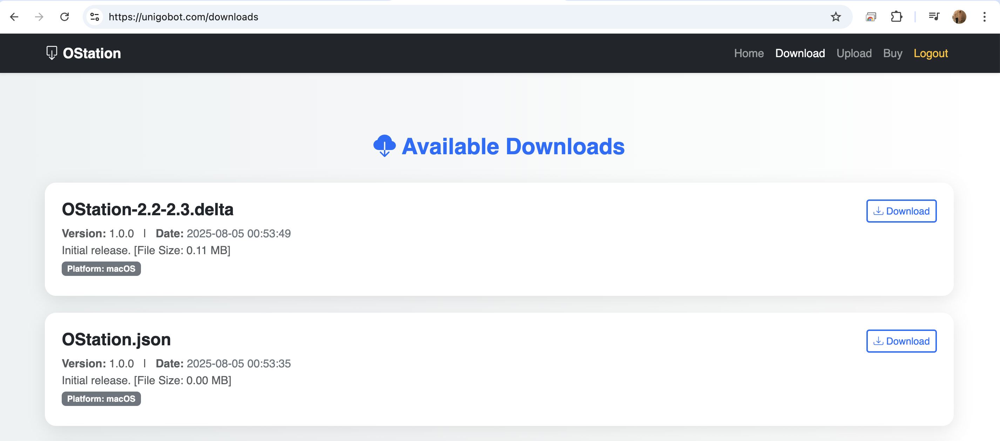

### 运维人员使用
### https://unigobot.com/downloads

## 4. 使用说明

*在此处填写详细的操作流程、使用示例等内容...*

## 5. 常见问题解答

*整理常见问题及对应解决方案...*

## 6. 更新历史

*记录版本更新内容及修复情况...*

## 7. GitHub 与社区支持

**GitHub 仓库地址：** [https://github.com/xuan139/OStation](https://github.com/xuan139/OStation) 

https://github.com/xuan139/SparkleUpdateTool

https://github.com/xuan139/unigo_website

